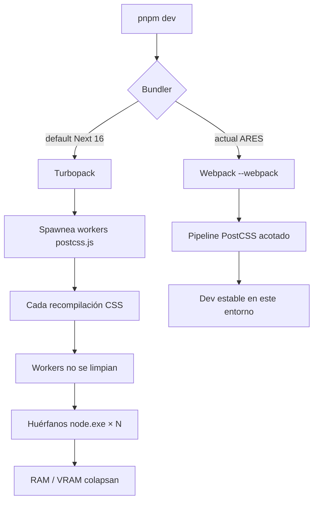
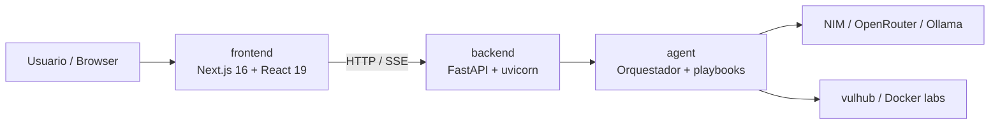

# DEV_NOTES — ARES

Notas internas de desarrollo. No sustituyen al README ni a INSTALACION.md.

---

## Dev server del frontend

```bash
cd frontend
pnpm dev    # → next dev --webpack
```

### Por qué `--webpack` y no Turbopack

**Nota:** Se usa `next dev --webpack` porque Next.js 16 + Turbopack + Tailwind v4 provocó una fuga de workers `postcss.js` en este entorno de desarrollo. Revisar si el problema sigue presente al actualizar Next.js.

| Campo | Detalle |
|-------|---------|
| Síntoma | Decenas/cientos de `node.exe`; RAM → 99%; en un caso reinicio por VRAM |
| Procesos | Todos: `frontend/.next/dev/build/postcss.js` |
| Causa | Workers PostCSS de Turbopack no se liberan (quedan huérfanos si el padre muere o al reiniciar `pnpm dev`) |
| Mitigación actual | Script `dev`: `next dev --webpack` en `frontend/package.json` |
| Versión afectada | `next@16.2.6` + `@tailwindcss/postcss` / Tailwind 4.2 + CSS de shadcn / tw-animate |
| Seguimiento | Probar de nuevo Turbopack tras actualizar Next; si es estable, quitar `--webpack` |



### Limpieza de emergencia (Windows)

Si vuelven a acumularse procesos Node huérfanos:

```powershell
Get-Process node -ErrorAction SilentlyContinue | Stop-Process -Force
```

Luego borrar caché de dev si hace falta:

```powershell
Remove-Item -Recurse -Force frontend\.next -ErrorAction SilentlyContinue
```

---

## Arquitectura rápida



| Capa | Ruta | Comando típico |
|------|------|----------------|
| Frontend | `frontend/` | `pnpm dev` |
| API | `backend/` | `uvicorn app.main:app --reload` (desde venv) |
| Agente | `agent/` | invocado por el backend |
| Labs | `agent/vulhub/` | gitignored; no versionar; pesado en disco |

---

## Stack frontend relevante

- **Next.js 16** (App Router), React 19
- **Tailwind CSS v4** vía `@tailwindcss/postcss`
- **shadcn** + `tw-animate-css` + framer-motion
- **`reactCompiler: true`** en `next.config.mjs` (revisar coste en dev si hay lentitud)

Variables útiles:

```env
NEXT_PUBLIC_API_URL=http://localhost:8000
```

---

## Backend / agente

- Python ≥ 3.11, venv en raíz (`venv/`)
- `uvicorn` con `--reload` en Windows usa SelectorEventLoop → los playbooks usan `subprocess.Popen` en hilos (`agent/playbooks/steps/_subprocess_utils.py`), no `asyncio.create_subprocess_*`
- Subprocess del agente solo al correr misiones/playbooks; no es la causa de la fuga de Node del frontend

Puertos habituales:

| Servicio | Puerto |
|----------|--------|
| Frontend | 3000 |
| Backend / agente | 8000 |

---

## Monorepo y cosas pesadas

- `agent/vulhub` está en `.gitignore` pero puede existir en disco (miles de archivos). No debe entrar al watcher del frontend si solo se corre `pnpm dev` dentro de `frontend/`.
- No hay `package.json` en la raíz: el frontend se gestiona solo con pnpm en `frontend/`.

---

## Checklist al actualizar Next.js

1. Actualizar `next` (y peers si aplica).
2. Probar temporalmente: `"dev": "next dev"` (Turbopack).
3. Observar 5–15 min el Administrador de tareas:
   - ¿Se multiplican `postcss.js`?
   - ¿La RAM de Node crece sin techo?
4. Si reaparece la fuga → volver a `next dev --webpack` y anotar la versión aquí.
5. Si es estable → dejar Turbopack y documentar la versión OK.

---

## Historial

| Fecha | Nota |
|-------|------|
| 2026-07-20 | Fuga confirmada: ~170 workers `postcss.js` huérfanos (~9.7 GB). Mitigación: `next dev --webpack`. |
