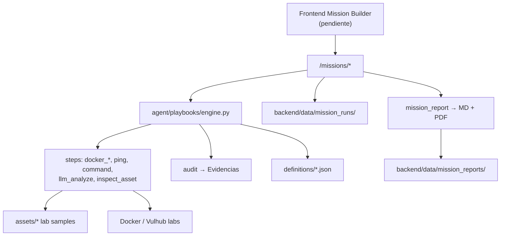
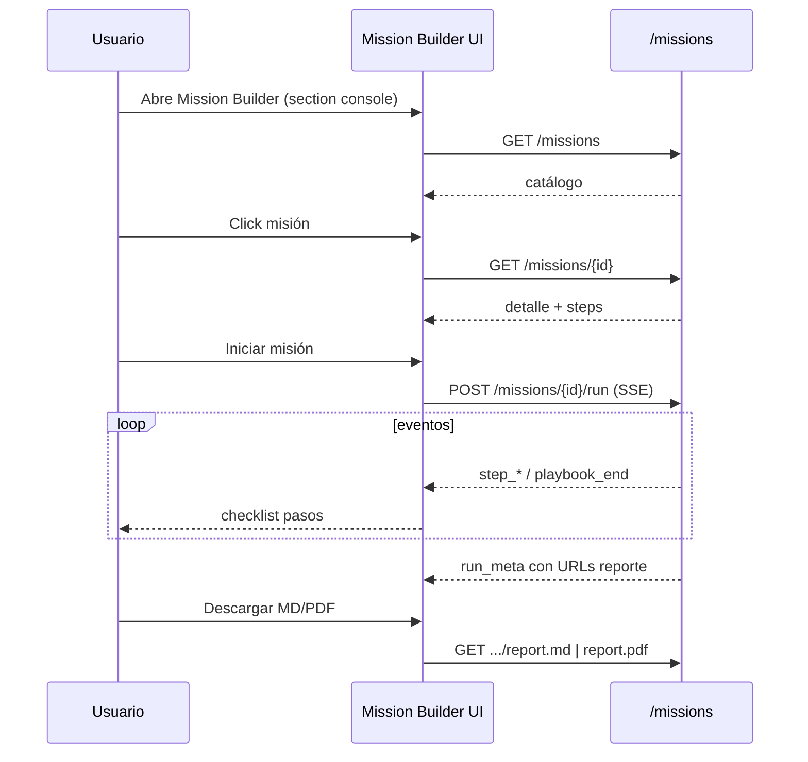

# Mission Builder — Backend (contexto para UI)

Documento de lo implementado en backend. **No hay UI nueva**: el frontend puede montar Mission Builder consumiendo estos endpoints.

Fecha de implementación: 2026-07-21  
Estado: backend listo · UI pendiente (a cargo del frontend)

---

## Decisiones de producto (cuestionario)

| Tema | Decisión |
|------|----------|
| Sidebar | Una sola entrada **Mission Builder** (reutilizar `id: console`) |
| Laboratorio + Playbooks | Unificados (eran el mismo concepto) |
| Listado UI | Lista vertical simple (UI a tu cargo) |
| Ejecución | Lista → detalle → ejecutar → Volver |
| Target visible | **No** (labs internos; `target` opcional) |
| Reporte | **MD + PDF** reales |
| Origen de misiones | 5 playbooks nuevos + `port_sweep` legacy |
| Términos | “misión” y “playbook” ambos OK |
| Evidencias | Sí — eventos en audit log + runs persistidos |
| Alcance esta pasada | Backend + reportes + labs Docker · **sin UI** |

---

## Arquitectura



Compatibilidad: `/playbooks` **sigue existiendo** (PipelineView actual no se rompe).  
`playbook_end.data` sigue siendo `"success"` | `"failed"` (string).

---

## Misiones disponibles

| ID | Título | Lab | Steps |
|----|--------|-----|-------|
| `hardening_linux` | Hardening Linux | Docker `ubuntu:22.04` | deploy → inventario → permisos → LLM → cleanup |
| `owasp_web_audit` | Auditoría Web OWASP | Docker `vulhub/httpd:2.4.49` | deploy → ping → fingerprint → sonda → LLM → cleanup |
| `linux_log_analysis` | Análisis de Logs Linux | Asset `sample_auth.log` | load → triage LLM → response LLM |
| `malware_investigation` | Investigación de Malware | Asset educativo `.py` | load → static LLM → report LLM |
| `pcap_analysis` | Análisis PCAP | Asset resumen PCAP | load → triage LLM → narrativa LLM |
| `port_sweep` | Port Sweep (legacy) | `vulhub/httpd:2.4.49` | como antes |

Definiciones: `agent/playbooks/definitions/*.json`  
Assets: `agent/playbooks/assets/`

---

## API HTTP

Base: `NEXT_PUBLIC_API_URL` (default `http://localhost:8000`)

### Catálogo

```http
GET /missions
GET /missions/{mission_id}
```

Respuesta (campos útiles para UI):

```json
{
  "id": "hardening_linux",
  "mission_id": "hardening_linux",
  "kind": "mission",
  "title": "Hardening Linux",
  "subtitle": "Blue Team · Baseline CIS",
  "description": "...",
  "duration": "~6 min",
  "tools": ["docker", "bash", "ARES LLM"],
  "category": "blue_team",
  "icon": "shield",
  "badge": "Blue Team",
  "difficulty": "intermediate",
  "requires_target": false,
  "lab": { "image": "ubuntu:22.04", "description": "..." },
  "steps": [
    { "id": "deploy", "type": "docker_deploy", "name": "Desplegar lab Ubuntu", ... }
  ]
}
```

### Ejecutar misión (SSE)

```http
POST /missions/{mission_id}/run
Content-Type: application/json

{ "target": "", "mode": "blue_team" }
```

- `target` **opcional** (string vacío OK si `requires_target: false`).
- Respuesta: `text/event-stream` (igual patrón que chat/playbooks).

Eventos SSE:

| `type` | Uso UI |
|--------|--------|
| `run_meta` | Inicio: `{ run_id, playbook_id, title }` |
| `step_start` | Marcar paso en curso |
| `step_output` | Log del paso (`data` string) |
| `step_end` | Paso ✔ |
| `error` | Paso fallido |
| `playbook_end` | `"success"` \| `"failed"` |
| `run_meta` (final) | `{ run_id, status, report_md, report_pdf }` URLs relativas |
| `[DONE]` | Fin de stream |

### Runs e historial

```http
GET /missions/runs?limit=50&mission_id=optional
GET /missions/runs/{run_id}
GET /missions/runs/{run_id}/report.md
GET /missions/runs/{run_id}/report.pdf
```

Los reportes también se generan al terminar el run y se guardan en disco.

### Legacy (no borrar)

```http
GET  /playbooks
GET  /playbooks/{id}
POST /playbooks/{id}/run   # body: { "target": "" }  ahora opcional
```

---

## Flujo UI sugerido (para implementar después)



Pseudocódigo frontend (no implementado):

```js
// 1) listar
const missions = await fetch(`${API}/missions`).then(r => r.json())

// 2) detalle
const detail = await fetch(`${API}/missions/${id}`).then(r => r.json())

// 3) ejecutar
const res = await fetch(`${API}/missions/${id}/run`, {
  method: 'POST',
  headers: { 'Content-Type': 'application/json' },
  body: JSON.stringify({ target: '', mode: selectedMode }),
})
// leer SSE como en PipelineView / chat stream

// 4) reporte
window.open(`${API}/missions/runs/${runId}/report.pdf`)
```

Sidebar (cuando hagas UI):

- Quitar item `lab` (Laboratorio)
- Renombrar item `console` → **Mission Builder**
- Renderizar el nuevo panel cuando `activeSection === "console"`

---

## Archivos tocados / nuevos

### Nuevos

| Ruta | Rol |
|------|-----|
| `agent/playbooks/definitions/hardening_linux.json` | Misión |
| `agent/playbooks/definitions/owasp_web_audit.json` | Misión |
| `agent/playbooks/definitions/linux_log_analysis.json` | Misión |
| `agent/playbooks/definitions/malware_investigation.json` | Misión |
| `agent/playbooks/definitions/pcap_analysis.json` | Misión |
| `agent/playbooks/assets/sample_auth.log` | Lab logs |
| `agent/playbooks/assets/sample_suspicious.py` | Muestra educativa |
| `agent/playbooks/assets/sample_http.pcap.txt` | Resumen PCAP |
| `agent/playbooks/steps/inspect_asset.py` | Step nuevo |
| `backend/app/api/missions.py` | API Mission Builder |
| `backend/app/services/mission_run_store.py` | Persistencia runs |
| `backend/app/services/mission_report.py` | MD + PDF |
| `MISSION_BUILDER.md` | Este documento |

### Modificados

| Ruta | Cambio |
|------|--------|
| `agent/playbooks/models.py` | Metadata misión + step `inspect_asset` + event `run_meta` |
| `agent/playbooks/engine.py` | `run_id`, audit enriquecido, import inspect_asset |
| `backend/app/api/playbooks.py` | `target` opcional |
| `backend/app/main.py` | `include_router(missions_router)` |
| `requirements.txt` | `pydantic`, `fpdf2` |
| `.gitignore` | `backend/data/` |

### Runtime (gitignored)

```
backend/data/mission_runs/*.json
backend/data/mission_reports/*.md
backend/data/mission_reports/*.pdf
```

---

## Evidencias

Cada misión escribe en `agent.core.audit` con types:

- `playbook_start` / `playbook_step` / `playbook_end` / `playbook_error`
- `details.mission = true`, `run_id`, `mission_id`

El panel **Evidencias** existente ya lista estos tipos. Los runs completos viven en `mission_runs` para reporte formal.

---

## Requisitos de entorno

```bash
# venv
pip install -r requirements.txt

# Docker Desktop (para misiones con lab)
# Imágenes que se pueden pull-ear al correr:
#   ubuntu:22.04
#   vulhub/httpd:2.4.49
#   curlimages/curl:8.5.0

# LLM (pasos llm_analyze)
#   NIM_API_KEY u otro provider configurado en .env
```

Misiones **sin Docker** (funcionan solo con LLM + assets):

- `linux_log_analysis`
- `malware_investigation`
- `pcap_analysis`

Misiones **con Docker**:

- `hardening_linux`
- `owasp_web_audit`
- `port_sweep`

---

## Prueba rápida backend

```bash
# listar
curl http://localhost:8000/missions

# detalle
curl http://localhost:8000/missions/linux_log_analysis

# ejecutar (SSE) — requiere uvicorn + LLM
curl -N -X POST http://localhost:8000/missions/linux_log_analysis/run \
  -H "Content-Type: application/json" \
  -d "{}"

# runs
curl http://localhost:8000/missions/runs
```

---

## Qué NO se hizo (a propósito)

- No se modificó UI de Sidebar / PipelineView / page.jsx
- No se eliminó `/playbooks`
- No se creó PDF “bonito” con plantillas corporativas (PDF funcional + MD rico)
- No se empaquetó PCAP binario real (asset texto educativo)

---

## Checklist UI (para ti)

- [ ] Sidebar: quitar Laboratorio; label Mission Builder en `console`
- [ ] Vista catálogo lista vertical (GET `/missions`)
- [ ] Vista detalle (GET `/missions/{id}`) con pasos preview
- [ ] Botón Iniciar → SSE POST `/missions/{id}/run`
- [ ] Checklist de pasos en vivo (reutilizar lógica de `PipelineView` o nueva)
- [ ] Al terminar: links a `report.md` / `report.pdf`
- [ ] Opcional: listar runs recientes en Evidencias o subpanel
