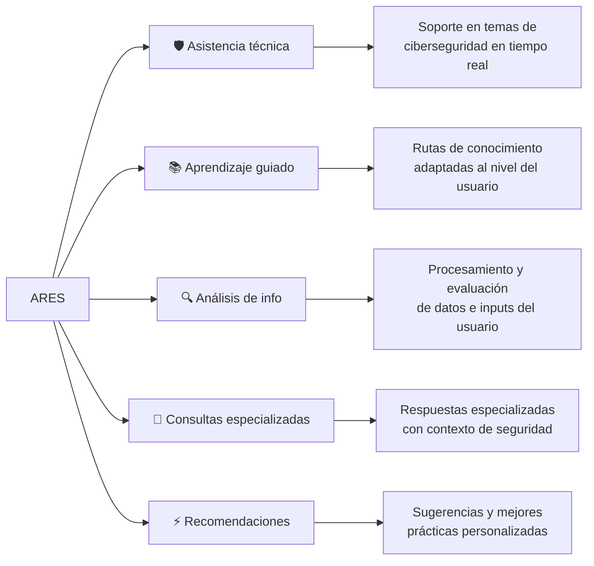
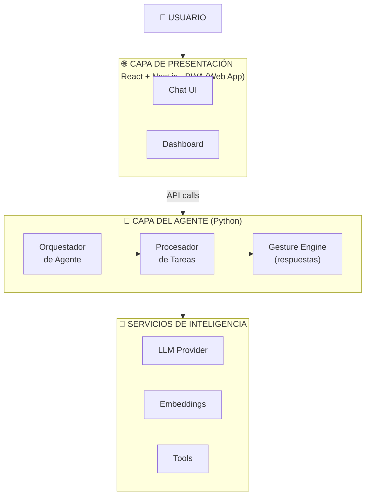
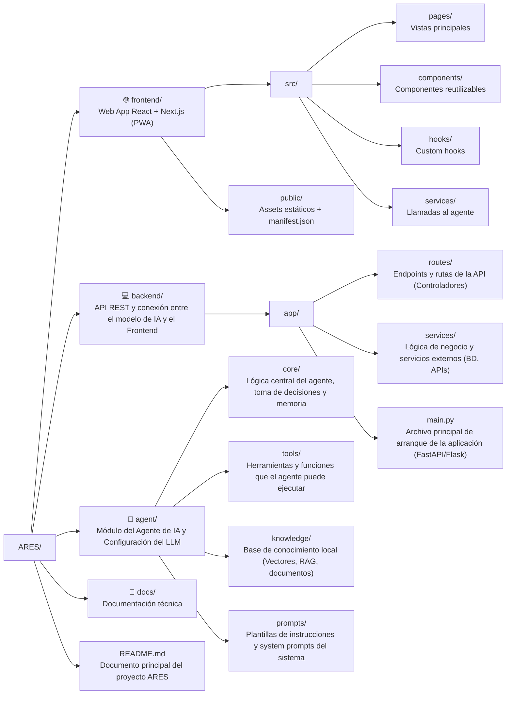

<div align="center">


# ARES — Agente de IA para Ciberseguridad

**[ SISTEMA ACTIVO ] [ MODO AGENTE ] [ CIBERSEGURIDAD ]**


*Asistente inteligente de ciberseguridad — Feria de Ciencias IEU 2026*

</div>

---

```
> Inicializando ARES...
> Cargando módulos de seguridad... [OK]
> Conectando con servicios de IA... [OK]
> Agente listo para operar.
```

---

## `~/` ¿Qué es ARES?

**ARES** es una solución de inteligencia artificial agéntica enfocada en ciberseguridad, diseñada para actuar como asistente técnico accesible desde una página web.

El sistema analiza solicitudes del usuario, proporciona explicaciones técnicas, orienta procesos de aprendizaje y ofrece recomendaciones especializadas en seguridad informática, todo a través de una interfaz conversacional impulsada por agentes de IA.

> *"Porque el conocimiento en ciberseguridad no debería estar detrás de una pared de requisitos técnicos."*

---

## `~/features` Capacidades del Agente



---

## `~/stack` Arquitectura del Sistema



### Tecnologías utilizadas

| Capa | Tecnología |
|------|-----------|
| Web App | React, Next.js |
| Agente / Backend | Python |
| IA | LLM vía API (agéntico) |
| Comunicación | REST / WebSocket |

---

## `~/install` Instalación

### Requisitos previos

```bash
node >= 18.0.0
python >= 3.11
```

### Clonar el repositorio

```bash
git clone https://github.com/devv-jr/ARES.git
cd ARES
```

### Preparar el entorno
```bash
python -m venv venv
source venv/bin/activate      # Linux/macOS
# venv\Scripts\activate       # Windows

pip install -r requirements.txt
```

### Web App (Next.js)

```bash
cd frontend
pnpm i
pnpm dev
```

### Backend para levantar al agente (Python)

```bash
cd backend

uvicorn app.main:app --reload
```

### Configurar variables de entorno

```bash
cp .env.example .env
# Editar .env con tus API keys y configuración
```

---

## `~/env` Variables de Entorno

```env
# Servicios de IA
# NIM (principal — se usa si tiene key, sin flag adicional)
NIM_API_KEY=nvapi-xxxxxxxxxxxxxxxx
NIM_MODEL=deepseek-ai/deepseek-v4-flash
NIM_TIMEOUT_SECONDS=35
NIM_MAX_TOKENS=512

# OpenRouter (respaldo, desactivado por default)
ALLOW_OPENROUTER_FALLBACK=false
OPENROUTER_API_KEY=tu_key_aqui
OPENROUTER_MODEL=openrouter/auto
OPENROUTER_TIMEOUT_SECONDS=35

# Ollama (respaldo, desactivado por default)
ALLOW_OLLAMA_FALLBACK=false

# ARES — Motor del Agente
ARES_MAX_CONTEXT_CHARS=2000
ARES_MAX_HISTORY_TURNS=3
ARES_RPM_LIMIT=35
```

---

## `~/structure` Estructura del Proyecto



---

## `~/team` Equipo

> Proyecto desarrollado para la **Feria de Ciencias — IEU Universidad, Puebla 2026**

| Integrante | Rol |                                                            
|-|-----------|-----|
| **Bruno** | Tech Lead · Full Stack Developer · Arquitectura e Integración |
| **Yered** | Frontend Developer · UI/UX Lead · Experiencia de usuario |
| **Jairo** | Backend Developer Junior · Python · Lógica del agente |
| **Axel** | Security Research · Documentación · Investigación en ciberseguridad |

---

## `~/license` Licencia

```
MIT License — 2026
ARES Project Team · IEU Universidad · Puebla, México
```

---

<div align="center">

```
[ ARES — AGENTE INTELIGENTE PARA CIBERSEGURIDAD ]
[ SISTEMA DESARROLLADO CON FINES EDUCATIVOS ]
[ IEU UNIVERSIDAD · PUEBLA · 2026 ]
```

</div>