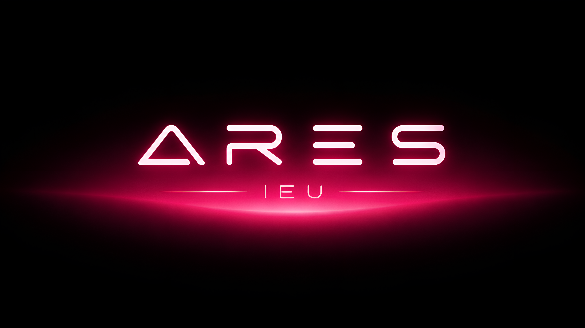

<div align="center">



# ARES — Agente de IA para Ciberseguridad

**[ SISTEMA ACTIVO ] [ MODO AGENTE ] [ CIBERSEGURIDAD ]**


*Asistente inteligente de ciberseguridad — Feria de Ciencias IEU 2026*

</div>

---

```
> Inicializando ARES...
> Cargando módulos de seguridad... [OK]
> Conectando con servicios de IA... [OK]
> Agente listo para operar.
```

---

## `~/` ¿Qué es ARES?

**ARES** es una solución de inteligencia artificial agéntica enfocada en ciberseguridad, diseñada para actuar como asistente técnico accesible desde una página web.

El sistema analiza solicitudes del usuario, proporciona explicaciones técnicas, orienta procesos de aprendizaje y ofrece recomendaciones especializadas en seguridad informática, todo a través de una interfaz conversacional impulsada por agentes de IA.

> *"Porque el conocimiento en ciberseguridad no debería estar detrás de una pared de requisitos técnicos."*

---

## `~/features` Capacidades del Agente

```
┌─────────────────────────────────────────────────────────┐
│  MÓDULOS ACTIVOS                                        │
├──────────────────────────┬──────────────────────────────┤
│  🛡️  Asistencia técnica  │  Soporte en temas de         │
│                          │  ciberseguridad en tiempo    │
│                          │  real                        │
├──────────────────────────┼──────────────────────────────┤
│  📚  Aprendizaje guiado  │  Rutas de conocimiento       │
│                          │  adaptadas al nivel del      │
│                          │  usuario                     │
├──────────────────────────┼──────────────────────────────┤
│  🔍  Análisis de info    │  Procesamiento y evaluación  │
│                          │  de datos e inputs del       │
│                          │  usuario                     │
├──────────────────────────┼──────────────────────────────┤
│  💬  Consultas           │  Respuestas especializadas   │
│      especializadas      │  con contexto de seguridad   │
├──────────────────────────┼──────────────────────────────┤
│  ⚡  Recomendaciones     │  Sugerencias y mejores       │
│                          │  prácticas personalizadas    │
└──────────────────────────┴──────────────────────────────┘
```

---

## `~/stack` Arquitectura del Sistema

```
┌──────────────────────────────────────────────────────────────┐
│                        USUARIO                               │
└──────────────────────────────┬───────────────────────────────┘
                               │
                               ▼
┌─────────────────────────────────────────────────────────────┐
│              🌐  CAPA DE PRESENTACIÓN                       │
│                                                             │
│              React + Next.js · PWA (Web App)                │
│         ┌─────────────┐  ┌──────────────┐                   │
│         │  Chat UI    │  │  Dashboard   │                   │
│         └─────────────┘  └──────────────┘                   │
└──────────────────────────────┬───────────────────────────────┘
                               │  API calls
                               ▼
┌──────────────────────────────────────────────────────────────┐
│              🤖  CAPA DEL AGENTE (Python)                    │
│                                                              │
│   ┌──────────────┐   ┌─────────────┐   ┌────────────────┐  │
│   │  Orquestador │──▶│  Procesador │──▶│ Gesture Engine │  │
│   │  de Agente   │   │  de Tareas  │   │  (respuestas)  │  │
│   └──────────────┘   └─────────────┘   └────────────────┘  │
└──────────────────────────────┬───────────────────────────────┘
                               │
                               ▼
┌──────────────────────────────────────────────────────────────┐
│              🧠  SERVICIOS DE INTELIGENCIA                   │
│                                                              │
│          LLM Provider  ·  Embeddings  ·  Tools               │
└──────────────────────────────────────────────────────────────┘
```

### Tecnologías utilizadas

| Capa | Tecnología |
|------|-----------|
| Web App / PWA | React, Next.js |
| Agente / Backend | Python |
| IA | LLM vía API (agéntico) |
| Comunicación | REST / WebSocket |

---

## `~/install` Instalación

### Requisitos previos

```bash
node >= 18.0.0
python >= 3.11
```

### Clonar el repositorio

```bash
git clone https://github.com/devv-jr/ARES.git
cd ARES
```

### Web App (Next.js)

```bash
cd frontend
pnpm i
pnpm dev
```

### Backend y el agente (Python)

```bash
cd backend
python -m venv venv
source venv/bin/activate      # Linux/macOS
# venv\Scripts\activate       # Windows

pip install -r requirements.txt
```

### Configurar variables de entorno

```bash
cp .env.example .env
# Editar .env con tus API keys y configuración
```

### Levantar el agente

```bash
uvicorn app.main:app --reload
```

---

## `~/env` Variables de Entorno

```env
# Servicios de IA
# NIM (principal — se usa si tiene key, sin flag adicional)
NIM_API_KEY=nvapi-xxxxxxxxxxxxxxxx
NIM_MODEL=deepseek-ai/deepseek-v4-flash
NIM_TIMEOUT_SECONDS=35
NIM_MAX_TOKENS=512

# OpenRouter (respaldo, desactivado por default)
ALLOW_OPENROUTER_FALLBACK=false
OPENROUTER_API_KEY=tu_key_aqui
OPENROUTER_MODEL=openrouter/auto
OPENROUTER_TIMEOUT_SECONDS=35

# Ollama (respaldo, desactivado por default)
ALLOW_OLLAMA_FALLBACK=false

# ARES — Motor del Agente
ARES_MAX_CONTEXT_CHARS=2000
ARES_MAX_HISTORY_TURNS=3
ARES_RPM_LIMIT=35
```

---

## `~/structure` Estructura del Proyecto

```
ARES/
├── 🌐 frontend/               # Web App React + Next.js (PWA)
│   ├── src/
│   │   ├── pages/              # Vistas principales
│   │   ├── components/         # Componentes reutilizables
│   │   ├── hooks/              # Custom hooks
│   │   └── services/           # Llamadas al agente
│   └── public/                 # Assets estáticos + manifest.json
│
├── 💻 backend/                # API REST y conexión entre el modelo de IA y el Frontend
│   └── app/
│       ├── routes/            # Endpoints y rutas de la API (Controladores)
│       ├── services/          # Lógica de negocio y servicios externos (BD, APIs)
│       └── main.py            # Archivo principal de arranque de la aplicación (FastAPI/Flask)
│
├── 🤖 agent/                  # Módulo del Agente de IA y Configuración del LLM
│   ├── core/                  # Lógica central del agente, toma de decisiones y memoria
│   ├── tools/                 # Herramientas y funciones que el agente puede ejecutar
│   ├── knowledge/             # Base de conocimiento local (Vectores, RAG, documentos)
│   └── prompts/               # Plantillas de instrucciones y system prompts del sistema
│
├── 📄 docs/                    # Documentación técnica
└── README.md                   # Documento principal del proyecto ARES
```

---

## `~/team` Equipo

> Proyecto desarrollado para la **Feria de Ciencias — IEU Universidad, Puebla 2026**

| | Integrante | Rol |
|-|-----------|-----|
| 🦏 | **Bruno** | Tech Lead · Full Stack Developer · Arquitectura e Integración |
| 🎨 | **Yered** | Frontend Developer · UI/UX Lead · Experiencia de usuario |
| 🐍 | **Jairo** | Backend Developer Junior · Python · Lógica del agente |
| 📚 | **Axel** | Security Research · Documentación · Investigación en ciberseguridad |

---

## `~/license` Licencia

```
MIT License — 2026
ARES Project Team · IEU Universidad · Puebla, México
```

---

<div align="center">

```
[ ARES — AGENTE INTELIGENTE PARA CIBERSEGURIDAD ]
[ SISTEMA DESARROLLADO CON FINES EDUCATIVOS ]
[ IEU UNIVERSIDAD · PUEBLA · 2026 ]
```

</div>
